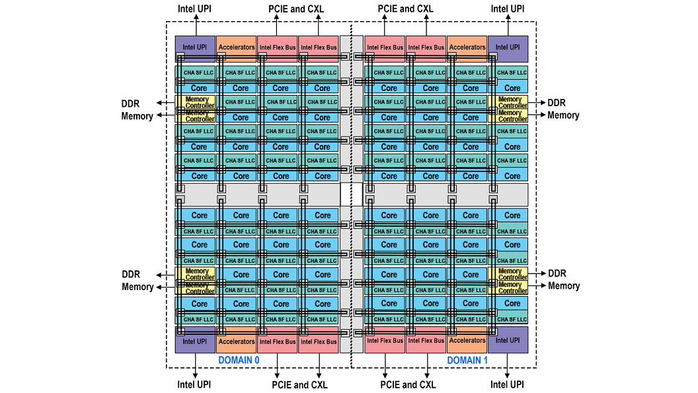

# Coresets
About how Sub-numa configuration (SNC, Intel) and Core-complexes (CCX, AMD) technologies work. 

# Sub-NUMA Clustering
- Partitions the processor and LLC into disjoint clusters, with each cluster bound to a set of memory controllers.
- Improves average latency to the LLC and memory.
- Idea is to decrease the latency of data movements.
- Each cluster appears as a NUMA node to the OS.
- The Sapphire Rapids processors support SNC4 SNC2 and "disabled" (default, each socket is a NUMA). Each can be configured from BIOS config.

## Detailed functioning
- In SNC2 two localization domains exist within a processor.
    - Each domain has mapped addresses from the local memory controller and LLC.
    - Cores from the local cluster will use the local memory controllers and the local LLC slices.
    - Cores from the local cluster will have lower (LLC and memory) latency compared to accesses mapped to locations outside the same SNC domain.
- With SNC activated, each address has a unique location in all the domains. But, foreign addresses are evenly distributed accross all LLC banks independent of the SNC mode.
## Example of SNC2

## Example of SNC4

**Links**
- https://www.intel.com/content/www/us/en/developer/articles/technical/fourth-generation-xeon-scalable-family-overview.html
- https://lenovopress.lenovo.com/lp1836-tuning-uefi-settings-4th-gen-intel-xeon-scalable-processor#snc
- https://community.intel.com/t5/Software-Tuning-Performance/About-Caching-Home-agent/m-p/1156700
- http://lastweek.io/notes/cache_coherence/
- http://www.staroceans.org/cache_coherency.htm
- https://silix.com.br/pdf/Intel/Intel_Mesh_Whitepaper.pdf
- https://www.researchgate.net/publication/279660275_Cache_Coherence_Protocol_and_Memory_Performance_of_the_Intel_Haswell-EP_Architecture
- https://link.springer.com/chapter/10.1007/978-3-031-40843-4_30
- https://repositories.lib.utexas.edu/server/api/core/bitstreams/7c5a5389-d124-41e0-bcbe-b5e95c03fc9b/content
- https://repositories.lib.utexas.edu/server/api/core/bitstreams/139f514b-842b-4150-9dc2-b6184fe6c546/content
- https://repositories.lib.utexas.edu/server/api/core/bitstreams/9ef9fc59-67de-477d-9819-6410cd57eb51/content